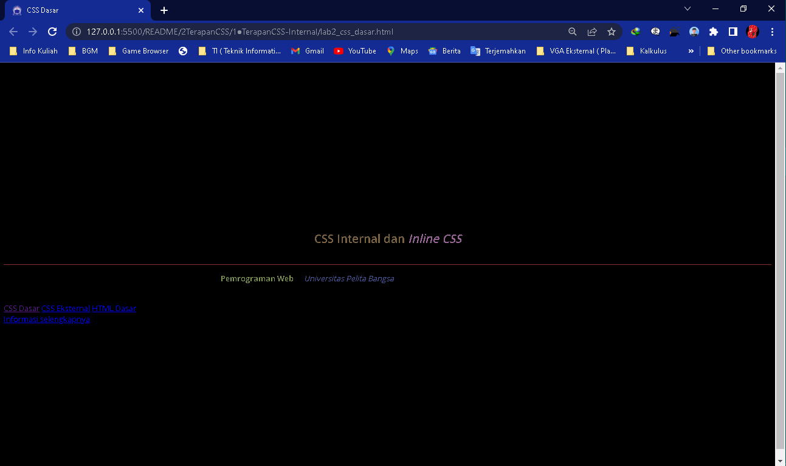
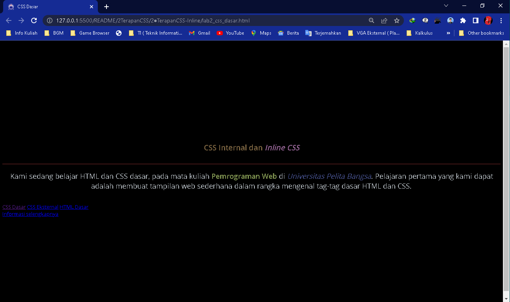
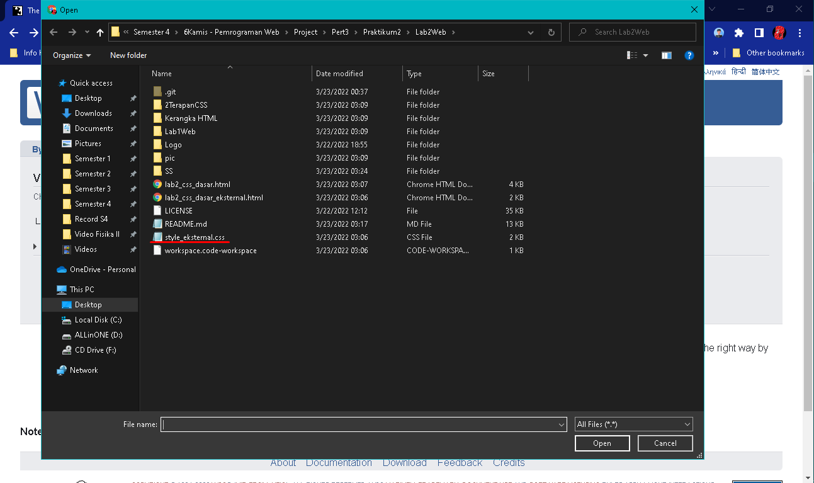

<p align="center">
	PEMROGRAMAN WEB
</p>
<p align="center">
	TUGAS PRATIKUM 2
</p>
<p align="center">
	Dosen Pengampu : Agung Nugroho, M.Kom
</p>
<p align="center"> 
	<b>Tugas untuk memenuhi syarat penilain pada Pert-3</b>
</p>

<p align="center">
	
</p>

<p align="center">
                 Nama  : Jose Fisto
</p>
<p align="center">
                 NIM   : 312010119
</p>
<p align="center">
                 Kelas : TI.20 A.1
</p>

<br/>
<br/>

<p align="center">
	<b>UNIVERSITAS PELITA BANGSA</b>
</p>
<p align="center">
	<b>FAKULTAS TEKNIK</b>
</p>
<p align="center">
	<b>TEKNIK INFORMATIKA</b>
</p>
<p align="center">
	<b>TA 2021 / 2022</b>
</p>

<br></br>

<hr>
</hr>

<br></br>

# Laporan Praktikum 2

## 1. Membuat File Dokumen HTML
Pertama buat file dokumen HTML dan save as dengan format nama ``lab2_css_dasar.html``, selanjutnya isi dengan koding sebagai contoh berikut :

```html
<!DOCTYPE html>
<html lang="en">
<head>
    <meta charset="UTF-8">
    <meta name="viewport" content="width=device-width, initial-scale=1.0">
    <title>CSS Dasar</title>
    <link rel = "icon" href ="logo.png" type = "image/x-icon">
</head>
<body>
    <!-- CSS ID Selector -->
    <div id="intro">
        <div class="chain">
            <header>
                <h1>CSS Internal dan <i>Inline CSS</i></h1>
            </header>
                <h1>Hello World</h1>
            <p>
                 Kami sedang belajar HTML dan CSS dasar, pada mata kuliah <b>Pemrograman Web</b> di <i>Universitas Pelita Bangsa</i>. Pelajaran pertama yang kami dapat adalah membuat tampilan web sederhana dalam rangka mengenal tag-tag dasar HTML dan CSS.
            </p>
            <nav>
                <a href="lab2_css_dasar.html">CSS Dasar</a>
                <a href="lab2_css_dasar_eksternal.html">CSS Eksternal</a>
                <a href="Lab1Web/Lab1_tag_dasar.html">HTML Dasar</a>
             </nav>
             <!-- CSS Class Selector -->
             <a class="button btn-primary" href="#intro">Informasi selengkapnya</a>
        </div>
    </div>
</body>
</html>
```

Selanjutnya Run untuk tampilkan output 

<p align="center">
	
</p>

## 2. Mengdeklarasikan 3 Jenis CSS

Setelahnya sematkan CSS, terdapat 3 jenis CSS digunakan dalam website sampai saat ini, yaitu CSS Internal, inline, dan Eksternal.

### ● Penerapan CSS Internal
Pertama mengdeklarasikan css internal dalam dokumen html, berikut merupakan koding css internal yang akan disematkan dalam kerangka head

```html
<head>
	...
	...
	...
</head>
```
Selanjutnya sematkan koding css pada kerangka head sebagai contoh berikut

```html
<head>
    <title>CSS Dasar</title>
    <link rel = "icon" href ="logo.png" type = "image/x-icon">   
    <style>       
        body{
            font-family: "Open Sans",sans-serif;
            min-height: 100vh;
            display: flex;
            align-items: center;
            justify-content: center;
            background-color: #000000;
        }
		header {
			min-height: 80px;
			border-bottom:1px solid #852c2c;
		}
        h1 {
        font-size: 24px;
        color: #7a6340;
        text-align: center;
        padding: 20px 10px;
        }
        h1 i {
        color:#966596;
        }
        p b {
            color:#829752;
        }
        p i {
            color:#4a5697;
        }
    </style>
</head>
```
Lakukan refresh pada halaman web sebelumnya untuk perubahan pada tampilan web

<p align="center">
	
</p>

#### ⏵ Style Selektor Tag h1 (header 1)
Pada tag ``<style>`` tag ``<h1>`` untuk menyematkan  style css di dalam kerangka tag ``<body>...</body>`` tertuju kepada tag ``<h1>``.

```html  
    <style>       
        h1 {
        font-size: 24px;
        color: #7a6340;
        text-align: center;
        padding: 20px 10px;
        }
        h1 i {
        color:#966596;
        }
    </style>
	....
	<body>
                <h1>CSS Internal dan <i>Inline CSS</i></h1>
	</body>
```
Berikut merupakan properti CSS pada tag ``<h1>`` :
- ``font-size``, mengatur ukuran besar kecilnya font tersebut,
- ``color``, mengubah warna dari tulisan,
- ``text-align``, mengatur posisi teks, dan
- ``padding``, mengatur jarak elemen HTML dari dalam.

#### ⏵ Style Selektor Tag p (paragraf)
Pada tag ``<style>`` tag ``<p>`` untuk menyematkan  style css di dalam kerangka tag ``<body>...</body>`` tertuju kepada tag ``<p>``, ``<b>``, dan ``<i>``.

```html  
    <style>       
        }
        p b {
            color:#829752;
        }
        p i {
            color:#4a5697;
        }
    </style>
	....
	<body>
			<p>
                Kami sedang belajar HTML dan CSS dasar, pada mata kuliah <b>Pemrograman Web</b> di <i>Universitas Pelita Bangsa</i>. Pelajaran pertama yang kami dapat adalah membuat tampilan web sederhana dalam rangka mengenal tag-tag dasar HTML dan CSS.
			</p>
	</body>			
```
Berikut merupakan properti CSS pada tag paragraf ``<p>``, bold ``<b>``, dan italic ``<i>`` :
- ``color``, mengubah warna dari tulisan.

#### ⏵ Style Selector Tag header
Pada tag ``<style>`` tag ``<header>...</header>`` untuk menyematkan  style css di dalam kerangka tag ``<body>...</body>`` tertuju kepada tag ``<header>``.

```html
	<style>       
        header {
			min-height: 80px;
			border-bottom:1px solid #852c2c;
		}
    </style>
	...
	<body>
            <header>
                ...
            </header>
	</body>
```
Berikut merupakan properti CSS pada tag ``<header>`` :
- ``<min-height>``, mengatur minimal tinggi dari sebuah obyek, dan
- ``<border-bottom>``, membuat style garis pinggir bagian bawah.

#### ⏵ Style Selector Tag body
Pada tag ``<style>`` tag ``<body>...</body>`` untuk menyematkan style css di semua elemen pada kerangka ``<body>...</body>``

```html
	<style>       
        body {
			font-family: "Open Sans",sans-serif;
            min-height: 100vh;
            display: flex;
            align-items: center;
            justify-content: center;
            background-color: #000000;
        }
    </style>
	...
	<body>
		...
		...
		...
	</body>
```
Berikut merupakan properti CSS pada tag ``<body>`` :
- ``<font-family>``,  untuk menentukan dan merubah jenis font yang digunakan pada teks,
- ``<min-height>``, mengatur minimal tinggi dari sebuah obyek, 
- ``<display>``, mengatur tampilan pada elemen,
- ``<align-items>``, menyalurkan item-item pada container flex yang diletakkan sepanjang garis tegak lurus pada sumbu utama (cross-axis),
- ``<justify-content>``, mensejajarkan item-item diantara flexbox agar container dari flexbox tersebut bisa mendistribusikan ruang kosong yang tersisa ketika item flex dalam satu baris tersebut tidak flexsibel atau meskipun flexsibel tapi sudah mencapai batas ukuran maksimum, dan
- ``<background-color>``, memberikan warna pada latar belakang suatu elemen.

### ● Penerapan CSS Inline
Kedua menerapkan CSS inline atau menyisipkan properti css pada elemen. Berikut adalah koding css inline di sisipkan pada elemen paragraf ``<p>``.

```html
			<p style="text-align: center; color: #bac1c7; line-height: 30px;
						margin-bottom: 40px; font-size: 22px;">
						....
			</p>
```
Output :

<p align="center">
	
</p>

Properti yang di sematkan pada tag paragraf ``<p>`` :
- ``text-align``, mengatur posisi teks,
- ``color``, mengubah warna dari tulisan,
- ``line-height``, mengatur ketinggian kotak garis elemen,
- ``margin-bottom``mengatur batas kertas sebelah bawah, dan
- ``font-size``, mengatur ukuran besar kecilnya font tersebut.

### ● Penerapan CSS Eksternal
Ketiga memanggil file dengan format .css sebagai desain untuk html secara terpisah sehingga tampilan html tampak lebih sedikit rapih.

Buat file dengan format .css lalu isi koding css setelahnya simpan dan contoh koding sebagai berikut

```css
nav {
    color:#fff;
    padding: 10px;
    }
    nav a {
    display: flex;
    justify-content: center;
    color: #fff;
    text-decoration: none;
    padding:10px 20px;
    }
    nav .active,
    nav a:hover {
    background: #9ac919c9;
    }
```
Selanjutnya tambahkan tag ``<link>`` pada kerangka ``<head>`` untuk memanggil file .css yang telah dibuat sebelumnya

```html
<head>
<!-- menyisipkan css eksternal -->   
    <link rel="stylesheet" href="style_eksternal.css" type="text/css">
</head>
```
Selanjutnya tampilkan output pada file html yang telah di sematkan tag ``<link>`` sebelumnya

<p align="center">
	
</p>

Pada HTML tersebut memanggil file CSS untuk memberi style atau desain kepada tag ``<nav>``

Berikut merupakan properti css di panggil dari file css :

- ``color``, merubah warna pada tulisan,
- ``padding``, untuk memberikan spasi atau ruang diantara konten dan border,
- ``display``, untuk mengatur tampilnya suatu elemen,
- ``justify-content``, mensejajarkan item-item diantara flexbox,
- ``text-decoration``, untuk memberikan efek garis pada text,
- ``.active``,  memberikan style ketika sebuah link telah terklik atau telah ada aksi pada element
- ``:hover``, untuk membuat efek saat mouse mengenai suatu element HTML,
- ``background``, untuk mengatur efek latar belakang pada suatu elemen.

#### ⏵ CSS Selector ID dan Class
Selanjutnya memasukkan selector dengan menggunakan ID dan Class, tulis atau salin koding / syntax berikut ini sebagai contoh berikut

```css
/* ID Selector */
#intro{
    background: url(/pic/OSBI-Lofi-Remix.gif) no-repeat left;
    background-size: 55%;
    background-color: #000000;
    overflow: hidden;
    padding: 100px 0;
}

/* Class Selector */
.chain{
    width: 55%;
    float: right;
    background-color: #6d6967b2;
    padding: 150px;
}

.chain h1{
    margin-bottom: 30px;
    font-size: 30px;
    font-weight: 900;
}

.button{
    display: flex;
    justify-content: center;
    color:#fff;
    padding: 15px 20px;
    background: #bebcbd;
    margin: 10px;
    text-decoration: none;
}

.btn-primary {
    background: #795a5e; 
}

.button{
    display: flex;
    justify-content: center;
    color:#fff;
    padding: 15px 20px;
    background: #bebcbd;
    margin: 10px;
    text-decoration: none;
}

.btn-primary {
    background: #795a5e; 
}
```

Tampilkan Output

<p align="center">
	
</p>

Penjelasan singkat :
- Selector ID, hanya dapat digunakan pada satu element saja, sedangkan
- Selector Class, dapat memanggil banyak element sekaligus pada html
- Selector ID ditandai dengan tanda pagar "#" sebagai awalan
- Selector Class ditandai dengan tanda titik "." sebagai awalan.

#### ⏵ CSS Universal Selector (*)
 CSS Universal Selector (*) berfungsi untuk menyeleksi setiap single element dari tipe element apapun atau secara keseluruhan.

 Berikut contoh syntax / koding

 ```css
 /* Universal Selector*/
*{
    margin: 0;
    padding: 0;
    box-sizing: border-box;
}
 ```

 Hasil Output / refersh pada halaman tampilan web

<p align="center">
	
</p>

#### ⏵ CSS Media Query
Media query merupakan modul CSS3 yang berfungsi menyesuaikan tampilan berdasarkan ukuran layar perangkat.

Syntax / Koding :

```css

@media screen and (max-width:1200px){
    .chain{
        padding: 80px;
    }
}

@media screen and (max-width:1000px){
    #intro{
        background-size: 100%;
        padding: 100px 40px;
    }
    .chain{
        width: 100%;
    }
}

@media screen and (max-width:600px){
    #intro{
        padding: 0;
    }
    .chain{
        padding: 60px;
    }
}
```

Hasil / output :

Tanpa Media Query

<p align="center">
	
</p>

Setelah menggunakan modul media query

<p align="center">
	
</p>

## 3. Validasi CSS

##### 1. Kunjungi Web Validasi CSS

Selanjutnya validasi dokumen CSS dengan mengakses https://jigsaw.w3.org/css-validator/

<p align="center">
	
</p>

##### 2. Pilih File CSS

Pilih file CSS yang telah di simpan sebelumnya

<p align="center">
	
</p>

##### 3. Klik Button Check

Setelah itu klik button check dan hasil akan muncul seperti di bawah ini

<p align="center">
	
</p>